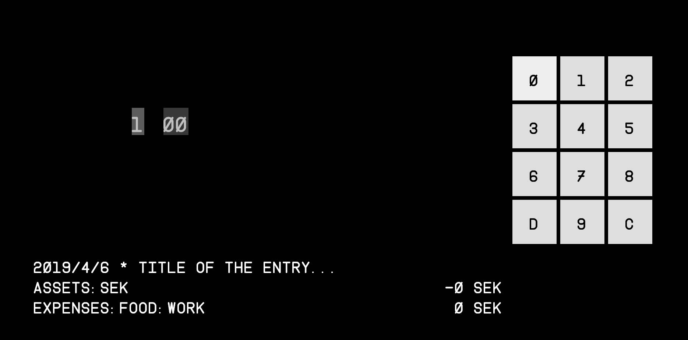

# Ledger terminal

Idea is to create a terminal which would make adding *ledger-cli* entries easier.
Imagine a Raspberry PI with a touchscreen and a comfortable user interface for
appending transactions.

